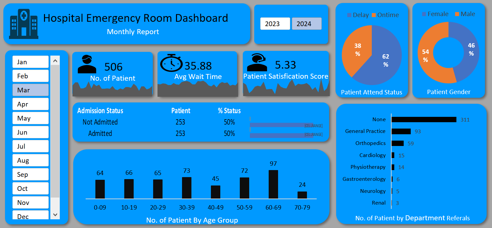

# 🏥 Hospital Emergency Room Dashboard (Excel Project)

## 📌 Project Overview
This project is an interactive **Hospital Emergency Room Dashboard** built completely in **Microsoft Excel** using **Power Query, PivotTables, Pivot Charts, Dynamic Slicers, and Dashboard Design techniques**.

The dashboard analyzes **99K+ patient visit records** to monitor hospital emergency room performance, patient flow, wait times, admissions, and department referrals.

The goal of this project was to transform raw hospital data into an interactive business dashboard that provides actionable operational insights.

---

---

# 🎯 Business Objectives

- Monitor emergency room patient volume
- Analyze average patient wait time
- Track patient satisfaction score
- Identify delayed attendance cases
- Understand patient demographics
- Analyze department referral patterns
- Monitor admission vs non-admission rates
- Identify peak busy periods

---

# 🛠 Tools & Technologies Used

- Microsoft Excel
- Power Query
- PivotTables
- Pivot Charts
- Dynamic Slicers
- Power Pivot
- Data Cleaning
- Dashboard Design
- KPI Cards
- Interactive Navigation

---

# 📂 Project Workflow

## 1️⃣ Data Cleaning & Preparation
Performed data transformation using **Power Query**:

- Removed duplicate patient records
- Standardized gender values
- Cleaned inconsistent data
- Created calculated fields
- Built calendar table for date analysis

---

## 2️⃣ Data Modeling
Created relationships between tables using Power Pivot:

- Calendar Table
- Patient Data Table
- Date hierarchy (Year/Month/Day)

---

## 3️⃣ Dashboard Development

Built interactive dashboard components including:

### KPI Cards
- Total Patients
- Average Wait Time
- Patient Satisfaction Score

### Interactive Charts
- Daily Patient Trends
- Wait Time Trends
- Satisfaction Trends
- Age Group Analysis
- Patient Gender Distribution
- Patient Attendance Status
- Department Referral Analysis
- Admission Status Analysis

### Interactivity
- Month Slicer
- Year Slicer
- Linked Charts
- Hyperlinked Navigation

---

# 📷 Dashboard Screenshot

## Main Dashboard

---

# 📈 Key Insights

- Average patient wait time was approximately **35 minutes**
- Around **38% patients experienced delays**
- Highest patient visits were observed in the **60–69 age group**
- General Practice received the highest department referrals
- Admission and non-admission rates were nearly equal

---

# ✨ Dashboard Features

✅ Interactive Excel Dashboard  
✅ Dynamic Slicers  
✅ Linked Pivot Charts  
✅ Automated Filtering  
✅ KPI Cards  
✅ Drill Navigation  
✅ Professional Dashboard Layout  
✅ Business Insights Generation  

---

# 🚀 Project Outcome

This project helped strengthen skills in:

- Data Cleaning
- Data Visualization
- Dashboard Design
- Business Analysis
- Excel Automation
- Interactive Reporting

It also demonstrates the complete workflow from:
**Raw Data → Data Cleaning → Data Modeling → Dashboard Creation → Business Insights**

---

# 💼 Use Case

This dashboard can help hospital management teams:

- Reduce patient waiting time
- Improve operational efficiency
- Monitor emergency room performance
- Analyze patient demographics
- Improve resource allocation

---

## 📬 Feedback

If you have any suggestions or feedback, feel free to connect with me on LinkedIn.

👉 [Connect with me on LinkedIn](https://www.linkedin.com/in/aman-chaudhary-4b2459236/)
